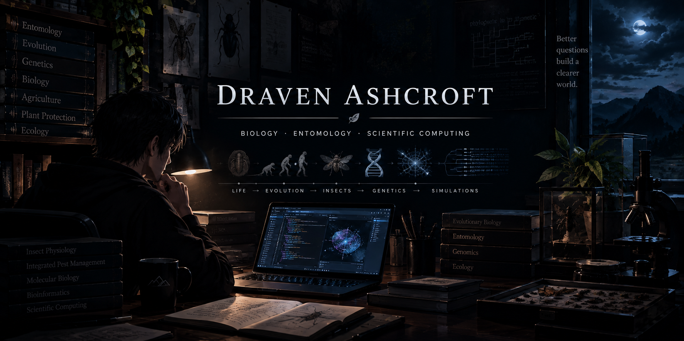

  

Draven Ashcroft

«Biology Lecturer  · Jalandhar»

""GitHub" (https://img.shields.io/badge/GitHub-181717?style=for-the-badge&logo=github&logoColor=white)" (https://github.com/Dray-Ashcroft) ""Email" (https://img.shields.io/badge/Email-EA4335?style=for-the-badge&logo=gmail&logoColor=white)" (mailto:draven.ashcroft@tuta.io)

---

About

"Building with Purpose, Disappearing in Shadows". Entomologist, ASRB NET.

- Currently building. Biology Simulation
- Currently learning. New patterns and the latest in web tooling.
- Open to collaborate on. Open source projects in TypeScript or Rust.
- Quick fact. I Smoke Cigarettes, Drink too much Coffee.

Skills

<b>💻 Languages</b> &nbsp;(4)

 "TypeScript" (https://img.shields.io/badge/TypeScript-3178C6?style=flat&logo=typescript&logoColor=white) "Kotlin" (https://img.shields.io/badge/Kotlin-7F52FF?style=flat&logo=kotlin&logoColor=white) "JavaScript" (https://img.shields.io/badge/JavaScript-F7DF1E?style=flat&logo=javascript&logoColor=white) "Java" (https://img.shields.io/badge/Java-ED8B00?style=flat&logo=java&logoColor=white)

<b>🧩 Frameworks & Backend</b> &nbsp;(1)

 "Next.js" (https://img.shields.io/badge/Next.js-000000?style=flat&logo=nextdotjs&logoColor=white)

<b>🗄️ Databases & Data</b> &nbsp;(1)

 "Supabase" (https://img.shields.io/badge/Supabase-3FCF8E?style=flat&logo=supabase&logoColor=white)

<b>☁️ DevOps & Cloud</b> &nbsp;(1)

 "GitHub" (https://img.shields.io/badge/GitHub-181717?style=flat&logo=github&logoColor=white)

<b>📱 Mobile</b> &nbsp;(1)

 "Android" (https://img.shields.io/badge/Android-34A853?style=flat&logo=android&logoColor=white)

<b>🛠️ Tools & Libraries</b> &nbsp;(2)

 "Vite" (https://img.shields.io/badge/Vite-646CFF?style=flat&logo=vite&logoColor=white) "pnpm" (https://img.shields.io/badge/pnpm-F69220?style=flat&logo=pnpm&logoColor=white)

GitHub

  
  
  

---

  
    
  

